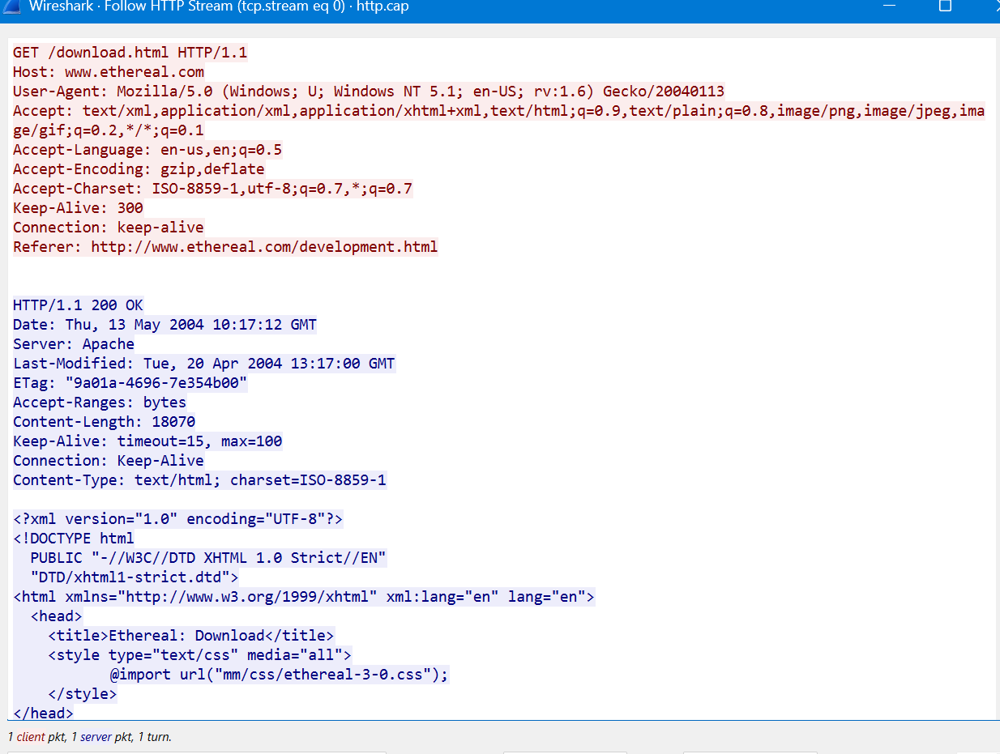

# SOC Analysis: Unencrypted Traffic Triage (Wireshark)

## Executive Summary
During a routine network security monitoring exercise, an alert was triggered regarding the use of insecure, unencrypted protocols within the enterprise network environment. As a Tier 1 SOC Analyst learner, I performed a deep-dive packet analysis using Wireshark to determine the scope of the exposure and identify the assets involved.

## Investigation Details
- **Analysis Tool:** Wireshark v4.x
- **Artifact Analyzed:** Network Packet Capture (PCAP)
- **Protocol Investigated:** HTTP (Hypertext Transfer Protocol) over Port 80

## Technical Analysis & OSINT Lookup

### 1. Packet Stream Reconstruction
To efficiently analyze the communication between the endpoints, I utilized the **"Follow HTTP Stream"** feature in Wireshark. This allowed me to reconstruct the full plaintext conversation between the client machine and the web server.

### 2. Evidence of Exposure
Upon inspecting the reconstructed HTTP stream, I identified cleartext data being transmitted over the network due to the lack of TLS/SSL encryption (Port 80). 

* **Source Internal Host (Client Address):** `145.254.160.237` (Internal Network Asset)
* **Destination External Host (Server Address):** `216.239.59.99` 

### 3. Open-Source Intelligence (OSINT) Attribution
Using `ipinfo.io` to perform IP attribution and a Whois lookup, the external destination IP was verified:
* **Resource Owner:** Google LLC (As per AS15169 registration)
* **Geographic Location:** United States

### 4. Analysis Screenshot
Below is the captured evidence showing the plaintext HTTP stream reconstruction:

## Defensive Recommendations (SOC Playbook)
1. **Enforce HTTPS:** Enforce a strict enterprise-wide policy utilizing HTTP Strict Transport Security (HSTS) to ensure all internal web traffic is encrypted via Port 443.
2. **Network Segmentation:** Implement strict firewall rules blocking outbound traffic to external public servers via legacy unencrypted management ports.
